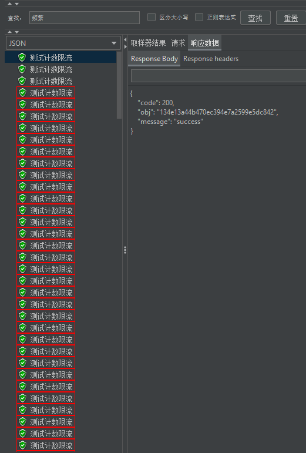

# 项目介绍
学校规定非选修课必须修满6学分，但是可气的是每次刚到开发时间选课网页都进不去，进去后课程都是名额已满
还差一学分，选了三学期没选到(不过还好多余的素拓分可以抵选修课的分数)，于是就想简易的单机模拟一下分布式的情况下
如何提高选课的并发量

## 技术栈
- Spring Boot, Redis, Mybatis-plus, MySQL, Thymeleaf, RabbitMQ
- 测压工具：Jmeter

## 模块介绍
### 登录模块
1. 生成UUID存入cookie，根据uuid存储和获取redis的学生数据，实现分布式session的处理
2. 登录时两次md5加密，第一次前端盐值写死，完成第一次加密，第二次取出数据库中的盐值对第一次此
加密结果进行二次加密，再与数据库中的进行比较
3. 用拦截器进行判断，避免学生重复登录或未登录访问非登录接口

### 选课接口
判断课程数量是否足够，学生是否重复选课

### rabbitmq死信队列实现选课成功超时未报道取消选课记录

## 选课流程
项目启动时便将课程名额信息加载如redis, 模拟数据预热
1. 登录
2. 登录成功后可以看到课程列表页面，查数据后`Thymeleaf`渲染直接返回前端html页面, 
用redis锁解决缓存击穿的问题
3. 选择某个课程进入课程详情页，同样用redis锁解决缓存击穿的问题
4. 点击确认选课
   1. 请求后端获取到每个用户对应课程的标识，用来生成选课路径(uuid,存在redis中)，避免计算机专业的学生选课作弊[狗头]
   2. 前端获取到路径后发起请求执行选课
5. 选课
   1. 首先获取到路径，判断路径是否正确
   2. 判断用户是否重复选课
   3. `decrement`预先减去名额，效率比`lua`脚本好，可能是`lua`脚本传输需要时间
   4. 预减名额如果小于0，返回名额不足
   5. 将选课信息放入消息队列，返回前端0，表示正在选课排队
      1. 消费者收到消息后，调用service层进行数据库操作
      2. mysql乐观锁减名额
      3. 减去成功则生成选课记录信息放入数据库
      4. 发送消息队列选课记录id——用来执行超时未报道取消的功能
6. 可以继续选课或等待选课结果，选课客户端轮询，判断是否选课成功。-1——选课失败；0——派对中；recordId——选课成功
7. 选课成功，浏览器跳转到选课记录详情界面，可以在此课程报道
8. 课程超时未报到
   1. 消费者收到消息传给service层
   2. 当学生没有给课程报道时设为超时未报到，存入数据库
   3. 成功后数据库课程名额+1，redis中的也+1

## 测压
- 用jmeter进行测压，[测压配置文件](data/HTTP请求.jmx)以及config.txt文件存储cookie
- 需要配置好redis哨兵模式，我只搞了一主一从一哨兵，虚拟内存吃满了
- rabbitmq配置，见`application.yml`、`com/huajframe/choosecourse/config/RabbitMQConfig.java`
   、`com/huajframe/choosecourse/rabbitmq/MqReceiver.java`、`com/huajframe/choosecourse/rabbitmq/MqSender.java`
- 将`data/dump.rdb`放在主设备的data目录下，重启即可
- 数据库mysql,见[数据库设计](data/choose_course.sql)
- `config.txt`、数据库中student表中的学生信息、`dump.rdb`，也可以运行
`src/test/java/com/huajframe/choosecourse/ChooseCourseApplicationTests.contextLoads()`方法

### 课程列表和课程详情接口
对这两个接口进行缓存击穿处理，redis中没有，压力全给到数据库
QPS提示1000左右多（主要是redis中数据没有时,大量请求都会去查数据库）

### 对课程详情接口进行了缓存穿透
防止用户用不存在的数据来访问接口，导致每次都要查数据库，redis中缓存空值

## 接口限流
用Spring Aop 自定义注解实现计数器限流，踩了一些坑

```java
//通过redis实现计数限流
BoundValueOperations<String, Object> boundValueOps = redisTemplate.boundValueOps(key);
Long count = boundValueOps.increment();
if(count == 1){
   boundValueOps.set(1, second, TimeUnit.SECONDS);
}else if(count > maxCount){
   return RespBean.error(RespBeanEnum.REQUEST_FREQUENTLY);
}
```

#### 测试 
- jemter测试接口 /record/path, `@AccessLimit(second = 5, maxCount = 3)`
- 200个线程，1s内



限流成功，只有3个携带了路径，其余返回访问频繁

#### 第一个
第一次尝试代码
```java
BoundValueOperations<String, Object> boundValueOps = redisTemplate.boundValueOps(key);
Integer count = boundValueOps.get();
if(count == null){
   boundValueOps.set(1, second, TimeUnit.SECONDS);
}else if(count > maxCount){
   return RespBean.error(RespBeanEnum.REQUEST_FREQUENTLY);
}else{
    boundValueOps.increment();
}
```
每次获取出来的count都为空，就是想不明白

怀疑是存储时含有特殊字符，如多了`"`引号，debug没发现，`url.replaceAll("\"", "");`
照样`count`为空。最后想到了是并发的问题，因为一瞬间请求进来都去get肯定为空，然后我把jemeter线程数改为
`8`，运行时间为`5`，限流成功，但是还是要优化一下代码

#### 第二个
第二次尝试代码
```java
//通过redis实现计数限流
BoundValueOperations<String, Object> boundValueOps = redisTemplate.boundValueOps(key);
Long count = boundValueOps.increment();
if(count == null){
   boundValueOps.set(1, second, TimeUnit.SECONDS);
}else if(count > maxCount){
   return RespBean.error(RespBeanEnum.REQUEST_FREQUENTLY);
}
```

jemeter测试，继续`8`,`5`，第一次测试实现限流，第二次没有，debug发现`ttl = -1`，然后才发现
是`Long count = boundValueOps.increment();`会自己从开始自增，所以肯定不会出现`count==null`的情况